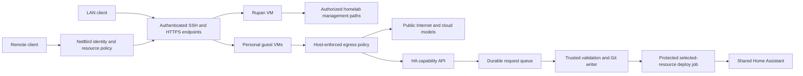

# Multiuser homelab agent workspaces

Status: historical (implemented; retained as a dated implementation record, not active state).

Date: 2026-09-12. Status: implementation handoff draft. This session authorizes research and planning, not deployment, account enrollment, publishing, hardware purchases, or changes to shared infrastructure.

## 1. Outcome and agreed requirements

Provide two personal coding environments initially, with a design that can expand to four. Each person can use SSH/local editors and an HTTPS browser editor/terminal. LAN access does not require NetBird; remote private access uses NetBird on the person's client device. Work continues after a client disconnects. Model inference uses each person's cloud provider account; no local model serving is required.

Each user can run arbitrary coding projects, install tools, administer their own guest OS, and run containers. Each has private repositories, files, provider credentials, and persistent storage. Only `rupan` receives broad homelab management access. Others receive shared household HA control and independent deployment of permitted automations, without Rupan reviewing each routine change. Shared devices do not require per-person ownership. Investigate and provide a separate migration for protecting Rupan's bedroom lights across HA UI/API as well as agent access.

Repo instructions remain the workflow contract. Guest-editable instruction files and agent permission prompts are not security controls. Enforce boundaries outside guest administrator control and at trusted deployment endpoints. Broad access for Rupan does not remove the repository's CI/Flux and deployment authorization rules.

## 2. Decision and limits

Use one KVM VM per person, managed by libvirt on a NixOS host, with conventional Linux guest images. Provide code-server and OpenSSH in each guest. Run Claude Code, Codex, and Antigravity's native `agy` CLI there, in tmux or explicitly supervised sessions. Do not require a desktop VM or depend on proprietary editor extensions.

Use a trusted HA capability API and protected worker for independent automation deployment. Guests never receive HA administrator, Kubernetes, host, CI deployment, registry-write, or SOPS decryption credentials. Their own HA nonadmin credentials may already exist outside the environment, so those account capabilities and public access paths must be audited too.

The resource-placement choice was offered to Rupan during research. Until superseded, the planning assumption is an **existing-hardware, two-user pilot on homelab-01**, conditional on the reservation/load-test gates below. A dedicated host is the expansion target if those gates fail or four active workspaces are required. This is not authorization to co-locate or buy hardware.

Guarantees are deliberately scoped:

- Root in a guest must not grant network, filesystem, or credential access to another guest or private infrastructure beyond its explicit HA capabilities.
- Arbitrary public Internet access means public homelab endpoints remain contactable. Authentication and authorization must deny protected data/actions there. Do not promise that every TCP connection to any homelab-owned public service can be blocked while arbitrary tunnels are allowed.
- Existing personal-device LAN access is a separate boundary. This project must not silently claim to restrict those devices; record any access they already have. NetBird invited-user identities must be limited regardless of which device holds them.
- Rupan and the virtualization host administrator are trusted. This design does not keep guest disks secret from the host administrator, defeat all hypervisor vulnerabilities, or guarantee uninterrupted work across host failure/reboot.
- Unlimited project types do not mean unlimited CPU, RAM, disk, network traffic, public hosting, or permission to modify shared infrastructure.

## 3. Evidence and placement

See [local observations](../../research/2026-09-12-agent-workspaces/findings_local.md) for commands, timestamps, source limitations, and the following snapshot.

| Host | Available RAM | Free local storage | Material existing responsibility |
| --- | --- | --- | --- |
| homelab-01 | 12.6 GiB | 912 GiB NVMe | etcd, HA, PostgreSQL databases; KVM present |
| homelab-02 | 10.0 GiB | 38 GiB SSD | etcd and workloads; KVM not enabled in probe |
| homelab-03 | 8.0 GiB | 39 GiB SSD | etcd, runners and workloads; KVM not enabled in probe |
| nas-01 | 1.9 GiB reported | 192 GiB shared ZFS pool capacity | storage, registry and protected CI; about 10.1 GiB reclaimable ARC |

These are point-in-time observations. NAS swap use is not by itself proof of sustained memory pressure because ARC accounts for much of its RAM. Do not make it the default guest host simply because its CPU is fastest; that co-locates arbitrary workloads with storage and privileged CI.

Pilot budget: two VMs, each 2 virtual CPUs, 4 GiB guest RAM, 100 GiB total fixed-capacity disks. Cap aggregate VM CPU time at 2 physical-core equivalents and budget at most 10 GiB host RAM including QEMU overhead. Verify the actual QEMU cgroup controls, not just configured virtual CPU count. Establish disk IO and network limits during the load test; the guest pair must not saturate the database NVMe or shared 1 GbE link. Keep at least 200 GiB host disk free after VM allocation and retained snapshots.

Before enabling co-location, explicitly reserve VM/host memory and CPU from Kubernetes allocatable resources and verify that all current requests still fit. The current module does not do this. Do not count zram, memory ballooning, or thin-disk overcommit as reserved capacity. Capture a baseline and compare a bounded simultaneous build/load test: no new etcd leader churn, node pressure, unexpected evictions, database errors, or loss of HA responsiveness. Stop the guest load on failure. Host pressure must shed guest work before database/etcd work; implement and test this behavior.

Do not enable third/fourth VMs by quietly overcommitting the pilot. Expansion requires measured headroom or a dedicated host. A planning envelope for four active users is 32 GiB RAM minimum, 64 GiB preferred for browser-heavy builds, and about 1 TiB local SSD. This is a sizing hypothesis, not a hardware shopping recommendation or benchmark. Keep the host configuration portable, with no requirement to remove an existing etcd member or migrate databases.

## 4. Execution and access architecture

Use NixOS for the host and a checksum-pinned Ubuntu 24.04 LTS cloud image for the initial guests. The conventional guest distribution reduces friction for vendor binaries and arbitrary development tooling. This does not replace the repository's pinned Nix development environment: install Nix in the guest so repo checks run through `nix develop ./flake`.

Create guest images from a reproducible manifest with dated upstream image URL, verified checksum/signature and tested tool versions. Never bake user secrets into an image or cloud-init seed. Generate new SSH host keys and machine identities on first boot. Updates to provider CLIs can be user-managed inside the VM, while the reproducible baseline records known-working versions. Host firewall and budgets remain unaffected by guest changes.

Give each VM its own disk files under a dedicated persistent host directory, with no shared host home, Nix store, Docker socket, libvirt socket, devices, or backup credentials. Do not expose libvirt TCP management. Run QEMU unprivileged with the minimum virtual devices and independently restricted access to disk files; verify isolation between QEMU processes as well as guests. No nested virtualization or hardware passthrough is required for ordinary containers.

Browser baseline: code-server with integrated terminal in each VM, behind TLS and workspace-specific authentication. Prefer a host-owned reverse proxy with a fixed hostname-to-guest mapping and separate per-workspace authentication. Keep proxy upstream ports unreachable through other ingress paths. Never disable authentication merely because a client is on LAN or NetBird. Disable SSH agent forwarding by default. Development previews use authenticated code-server forwarding or SSH local tunnels into the same VM, with WebSocket and Origin handling tested. Never turn the trusted proxy into an arbitrary URL forwarder.

Use a TLS certificate managed outside the guest where it spans infrastructure; expose no DNS API token to guests. Allocate actual hostnames/IPs from observed DNS and routing inventory during provisioning. No invented addresses or users should be committed. SSH keys and browser login identities are explicit per-person enrollment data. Rupan may administer guests through an audited recovery path, but should not forward privileged agent sockets or reuse infrastructure credentials inside guest-controlled sessions.

tmux guarantees persistence across transport disconnects, not safe resumption after reboot. Supervised user services must enable logout persistence deliberately. On reboot report interrupted sessions and require an explicit safe resume workflow, rather than blindly re-running previous deployment commands.

## 5. Network contract

Create one host-owned, isolated virtual bridge/tap segment per VM. No guest joins physical VLAN 20/30, a shared default libvirt network, or a Kubernetes pod network. Host-local VM routing is an explicit exception to the current documentation's simplified statement that OPNsense is the only router: OPNsense remains the inter-VLAN router; the host routes only its private VM segments. Update that distinction in the network runbook.

Allocate a collision-checked private address block, divided into per-VM segments. Route narrowly selected workspace addresses from OPNsense through the chosen host for LAN access; publish the same addresses as NetBird resources. Define both forward and return paths, including any Internet-only source NAT. Do not depend on a new physical VLAN trunk through the unmanaged cluster switch. Use host-owned bridges with libvirt's external-bridge mode so Nix owns addresses/routing/firewall and libvirt owns VM lifecycle. Disable the libvirt default network. No independent auto-generated broad NAT firewall is allowed.

| Source | Allowed destination | Enforcement |
| --- | --- | --- |
| Authenticated LAN user | Own SSH/browser workspace | Narrow router ingress plus endpoint identity |
| Invited NetBird identity | Own workspace IP and TCP entry ports | NetBird resource grant plus endpoint identity |
| Guest VM | Fixed HA capability API HTTPS endpoint | Host interface-bound egress and API identity |
| Guest VM | Approved DNS/NTP, public Internet | Host destination policy, return-path state |
| Guest VM | Other VMs, hypervisor, private services, MQTT, raw HA | Deny on host before routing/NAT |
| Rupan VM | Inventory-defined management targets | Separate host policy and service credentials |
| Trusted HA worker | Required HA and baseline interfaces only | Worker identity, network and deployment policy |

Bind permissions to host-controlled ingress tap/bridge identity, not a guest-supplied IP. Reject spoofed source MAC/IP, tagged frames, secondary-address bypasses, guest-to-guest traffic and host INPUT access. Cover host local services, pod CIDR `10.42.0.0/16`, service CIDR `10.43.0.0/16`, all homelab/private/special ranges, overlay ranges, link-local/metadata, loopback/martian sources and actual global IPv6 destinations. Disable IPv6 at the host guest boundary initially unless equivalent IPv6 policy is implemented and tested. DNS filtering alone is insufficient. Permit established responses only with anti-spoofing and correct interface direction.

The allowlisted HA API address must expose only that service. If it shares an ingress VIP, prove that alternate Host/SNI values cannot reach other applications. Prefer a dedicated endpoint. Perform filtering before any guest Internet SNAT makes traffic resemble the privileged host. Ensure Cilium host routing/BPF behavior cannot bypass the intended hook. Atomic policy replacement, boot ordering and libvirt/Nix firewall restarts must fail closed; guests cannot start before effective rules are installed and verified.

NetBird: keep routing on trusted infrastructure. Never enroll guest VMs into Rupan's broad peer group. Inventory all additive grants, including default All-to-All, peer input grants and routed-resource grants. Existing OPNsense VLAN60 permits all `10.0.0.0/8`; therefore a narrow policy cannot be inferred from that firewall. Establish and test Rupan's recovery access first, then scope invited identities to their own workspace resources. Resource grants must work even if someone installs NetBird inside their VM using their own account. Masqueraded downstream addresses do not identify the human.

Use existing OPNsense CI ownership for routes and firewall changes, extending the reconciler only if the pinned provider lacks a resource. NetBird policy source ownership is currently unverified: establish one reviewed manifest/API reconciliation path and a redacted drift/export procedure before enrollment. No ad-hoc dashboard-only configuration may silently become a second owner.

## 6. HA capabilities and independent deployment

All invited users share the same approved household-device catalog. The catalog is about safe household actions, not per-person room ownership. Device control and automation authorship do not grant administrative integration/configuration capabilities.

### API and policy

Implement a small authenticated capability API, with a CLI/MCP adapter for agents. Use one API and one durable queue, not a general agent orchestration platform. A single-replica SQLite queue on persistent storage is sufficient initially if concurrency, crash recovery and backups are tested. Its public-facing process has no main-branch Git writer, infrastructure kubeconfig, or HA administrator token. A separate trusted worker validates and processes queued data. Any state-read credential is limited and cannot be returned to clients.

Proposed versioned API contract:

| Operation | Input and result |
| --- | --- |
| Read catalog/state | Sanitized permitted entities, typed actions and policy version; no credentials or broad template endpoint |
| Control device | Explicit entity ids, permitted action, validated typed arguments, idempotency key; result with actor audit |
| Submit automation | API version, idempotency key, operation, resource id, expected resource revision, structured automation; returns request id |
| Read request | queued/validating/rejected/committed/deploying/verified/failed/conflict state, actionable error and committed revision |
| Read managed automation | Canonical desired/live status and revision sufficient to update or delete it safely |

The server derives the actor from authentication; it never accepts the claimed actor or Git author as authorization. All users can edit shared guest-managed automations, subject to optimistic concurrency. Reserve flat filenames/ids beginning `shared_agent_` under `home-assistant/automations/`, matching the existing loader. Existing privileged/owner automations remain outside guest-editable scope. Adopting an existing shared automation into this scope requires a one-time policy review; do not infer permission from its title.

Accept a typed, bounded JSON representation and compile canonical YAML, rather than accepting arbitrary repository patches or executable YAML. Initial support: state/numeric-state/time/sun triggers, entity comparisons, bounded conditions/choose/delay/repeat, and explicit typed household service calls. Define actual catalog entries from installed integrations. Recursively validate every nested node. Reject unknown fields, dynamic service names/targets, arbitrary Jinja, event emission, unrestricted scripts/scenes/blueprints, MQTT publication, shell/Python/REST commands, integration reloads, config edits, secret references and arbitrary URL arguments. Add capabilities through reviewed policy changes with tests. Report unsupported requests clearly without silently weakening restrictions.

Bound payload size, nesting, numbers of automations/actions, trigger frequency, repeats, concurrency, duration and device-call rate. Bound deployed behavior, not merely submission HTTP rate. Actions needing enforceable runtime quotas must execute through a metered trusted capability service, or remain unsupported; syntactic limits alone do not bound rapidly retriggered native HA automations. Never execute guest code, hooks, CI YAML, scripts, or dependencies on the trusted worker/runner.

### One desired-state owner and deployment transaction

`home-assistant/automations/` in this repository remains the accepted source of truth. The queue is a request/audit record, not a second desired-state repository. Do not create a competing automation repository whose content can diverge silently.

1. Authenticate, bound and enqueue the request with an idempotency key bound to actor and canonical body hash. Reuse returns the same job; a different body with the same key fails.
2. Trusted worker loads the protected policy and current main revision. It reads fresh live state/baseline through the existing HA contract and rejects conflicts, incomplete evidence or stale expected resource revisions.
3. Compile the permitted payload, validate it offline and construct a Git change containing only the exact managed resource file. Check file type, path, identifier, allowed diff and deletion scope independently. No symlinks, executable files, submodules or hooks. A guest never supplies a commit/tree to execute.
4. Commit with a dedicated bot identity using compare-and-swap against the expected main tip. Retry unrelated concurrent main changes by rebuilding and revalidating; never force-push or overwrite a conflict. Protect the writer credential outside the API and guest VMs. GitLab project write tokens are not inherently path-restricted: the trusted writer is a privileged component and must independently enforce the path/content policy.
5. Run an automatic **selected-resource guest deployment job**, bound to the committed resource hash, request id, policy version and current permitted state. Keep existing owner/general HA jobs manual. Do not trust a user-supplied pipeline variable, commit message, or actor string to select the privileged path. Verify an authenticated worker request against the durable job record and revalidate in the protected job.
6. Reuse the existing HA lease, read-before-write, readback and baseline contracts. Serialize with the existing `home-assistant-homelab-01` resource group. Deploy only the named managed resources; never apply all outstanding owner/UI changes as a side effect. Verify the existing partial-selection baseline behavior and fix it if necessary before automation.
7. Mark verified only after live readback matches the accepted source. Record exact source/policy hashes, actor, timings, previous resource hash, CI identity and outcome. A failed CI run leaves a visible committed-but-not-deployed job that can be retried idempotently. After an uncertain write, read back and reconcile before repeating.

An old pipeline must not revert a newer accepted resource revision. Check current desired resource hash immediately before apply; either fail obsolete work or safely coalesce it. Do not advance a global baseline for resources outside the verified selection. Policy revocation must be checked again at deployment, not only submission. Disabling a user prevents new requests and pending uncommitted work; whether existing shared automations remain active is an explicit owner action, not an accidental side effect of credential expiry.

Once the initial bounded path is explicitly authorized and deployed, normal allowed submissions need no Rupan approval. Update the HA runbook and agent-facing rules to record this standing authorization. Changes to policies, credentials, networking, integration administration and the deployment system retain the normal owner approval boundary.

### Direct UI/API and egress caveat

HA's native automation configuration API requires an administrator. Keep ordinary human accounts nonadmin. They can use the existing UI for shared device control, while their agent uses the capability API for creation/deployment. Native nonadmin automation-editor support is not promised.

A root guest can reuse a personal HA token and reach public HA over the Internet. Therefore review all existing nonadmin-callable services, scripts, scenes, events, URL-taking integrations and custom integrations for relay or privilege effects. The source-only policy cannot close that alternate path. Block unsafe service effects at their owner, remove unused capabilities, and ensure protected public origins require authorization with no home-WAN trusted exemption. If a problematic native action cannot be constrained, do not enable guest deployment claiming full isolation; record the actual scope and resolve the service boundary first.

HA currently uses `hostNetwork: true`. Do not treat an ordinary Kubernetes NetworkPolicy as a verified HA egress sandbox. Evaluate removing host networking using explicit integration endpoints and required HomeKit ports/discovery, or a genuinely isolated HA network boundary, before claiming HA itself cannot relay into management services. This is a compatibility-sensitive work item requiring an integration inventory and device tests. Preserve required PostgreSQL, MQTT and device connectivity. Do not blindly drop host traffic shared with etcd/other services.

The runbook requires pausing UI edits during writes because HA lacks atomic compare-and-swap. Guests remain nonadmins and therefore do not create a competing native configuration writer. Rupan must use the same queue/lease for managed automation edits, or explicitly pause processing for an owner UI-edit/adoption window. The lease alone cannot prevent an independent UI edit racing between read and write.

## 7. Bedroom protection workstream

Do not claim that hiding a dashboard or marking an entity hidden protects it. The reviewed native permission machinery is not enough evidence for complete supported UI/API/indirect isolation.

The practical design is a private HA instance or controller for Rupan's three Roku bedroom lights. Select the private HA instance for an implementation spike so Rupan retains the familiar UI and automation interface. Deploy its desired state through Flux, with its own authentication, storage, service endpoint and instance-qualified baseline/lock names. Give only Rupan access through LAN authentication and his NetBird group.

Before migration, read the Roku runbook and inventory bridge topics, discovery, bulb credentials, shared HomeKit/Home app permissions, cloud/vendor access and mixed automations. The current shared HA MQTT principal has `roku/#` rights; remove bedroom topic/discovery rights from it and give them only to the private instance and bridge. Do not copy the broad old MQTT credential into the private service. Ensure discovery cannot re-add bedroom control to shared HA after a restart or retained-message replay. Remove bedroom devices and any controlling scripts/scenes from shared HA, and split `away_lights_off_restore` plus other mixed automations deliberately.

Do not re-export bedroom control into shared HA to make an owner dashboard convenient. Inventory the HomeKit bridge, which currently includes lights, and revoke shared bridge access to bedroom controls. Ensure shared HA cannot reach bulb TCP 88 or a broad MQTT/HTTP relay using alternate credentials. Keep the private instance's configuration in an explicit new source directory, with tests ensuring the existing loader never adopts it into shared desired state.

Acceptance requires both guest UI/API denial and actual lack of bedroom command delivery, plus successful private Rupan control. Roku states are optimistic; use bridge evidence and a person observing the lights for final physical confirmation. Include negative tests for all-light/area calls, scripts/scenes, MQTT publication/discovery, HomeKit and restored old credentials. Physical switches and preexisting vendor-cloud accounts are separate access paths to inventory.

This migration changes shared HA, MQTT and light behavior and needs explicit deployment approval. It may be implemented after the workspace pilot, but bedroom privacy must remain labeled **not enforced** until its own acceptance tests pass. Do not use an unreviewed `.storage/auth` edit as a shortcut.

## 8. Implementation packages and ownership

Implement in dependency order. Parallel work is optional; if agents are delegated, keep these file ownership boundaries and integrate shared entrypoint changes serially. Existing paths are authoritative; proposed new paths below are implementation targets, not files already present.

| Package | Files / owner scope | Deliverable and minimum acceptance |
| --- | --- | --- |
| A: preflight and inventory | Local `.agent-state/`; new workspace runbook | Selected host, capacity history, collision-free addresses, enrolled identity inputs, public/HA/NetBird access inventory; no secrets in report |
| B: VM host and guest baseline | New `flake/modules/agent-workspaces.nix`, `config/agent-workspaces/`, `scripts/agent_workspaces/`, `tests/test_agent_workspaces_*.py` | Deterministic manifests, pinned images, idempotent provisioning, per-VM storage/resource controls, lifecycle, no exposed host sockets |
| C: network and ingress | New `flake/modules/agent-workspace-network.nix`, owning OPNsense sources, NetBird policy manifest/reconciler, network tests | LAN/NetBird entry, HTTPS identity, external guest firewall, spoofing/IPv6/alternate-path tests |
| D: HA policy and API | New `scripts/ha_capabilities/`, `config/ha-capabilities/`, `tests/test_ha_capabilities_*.py` | Typed API/compiler, queue, auth, quotas, conflict/idempotency tests; untrusted input cannot become commands |
| E: trusted deployment integration | `scripts/home_assistant/`, `.gitlab-ci.yml`, corresponding tests and HA runbook | Exact-resource Git transaction and auto job, lease/baseline correctness, stale-job rejection and retry evidence |
| F: bedroom isolation | New `gitops/home-assistant-private/`, private source directory, Roku/MQTT owner module, HA resources/runbooks | Private authentication and topic/device separation, preserved Rupan behavior, no shared control |
| G: integration and handoff | `flake/hosts/<selected-host>/default.nix`, `flake/flake.nix`, `AGENT_MAP.md`, `justfile`, cluster entrypoints and docs | Single owner merges interfaces, runs combined gates, records approval and live evidence |

For package B inventory define a strict schema covering workspace id, owner identity, trust class, host, image digest, disk paths/capacities, CPU/RAM/IO limits, network segment, interface identity, SSH keys, browser identity and enabled state. Reject duplicate identities/addresses/disks and invalid trust class. Secret references identify runtime files or encrypted resources; plaintext secrets never appear in manifests. Absence of an invited user's actual identity keeps that entry disabled rather than manufacturing a placeholder account.

Add narrow command contracts under the existing `just` workflow: offline manifest validation, render/plan, explicit authorized provisioning, status and evidence collection. Provisioning must never delete/reformat existing disks on a name collision, replace an unknown VM, or infer approval from a missing state file. Inspect actual domain UUID/disk ownership before adoption. Existing user disks survive image updates and deprovisioning by default.

Use the existing pinned environment for Python/Nix/YAML checks. Query pinned NixOS options before implementation; unavailable MCP tools do not justify invented options. Every added runtime container follows `just registry-inventory` and the registry-lock workflow. Config-sensitive pod templates need checksums. New secrets follow an explicit SOPS rule/ExternalSecret ownership path; the current rule is limited to `gitops/secrets/`.

## 9. Verification, release and rollback

Offline acceptance:

1. Unit tests cover API authorization, nested compiler rejects, resource revisions, stale requests, duplicate delivery, Git compare-and-swap, policy changes, queue crash recovery and partial-selection baselines.
2. Render and evaluate VM definitions, resources, network rules and denied interface classes. Run a disposable VM/network integration test with root inside the guest, without production credentials. Test guest Docker/NAT, spoofed packets, IPv6, DNS rebinding/alternate target paths and firewall reloads. Source-string assertions are insufficient.
3. Validate the host closure and GitOps manifests using `just check-changed`, `just check`, `just fmt-check`, the relevant Nix build and registry checks. Review exact changed files and secrets. Do not stage unrelated work or bypass hooks.

Authorized deployment order:

1. Record target identity, final diff/plan, enrollment scope, recovery path and initial policy authorization. Preserve a working Rupan management connection.
2. Deploy closed network boundary and VM host through owning CI paths. Verify deny rules before booting an invited-user VM. On co-location, install scheduler reservations first and verify workload fit.
3. Boot baseline VMs, enroll real user credentials privately, then test LAN with NetBird stopped and external-network NetBird access. Verify one user cannot enter another workspace. No automatic broad group enrollment.
4. Deploy HA API/worker manifests through Flux and protected CI changes through the approved repository flow. Prove policy rejects with production credentials absent, then run one benign selected-device request and verify Git, CI and live readback agree.
5. Test simultaneous changes, an owner UI-edit conflict, worker crash, stale main revision, policy revocation and failed apply. None may overwrite newer work or advance an unverified baseline.
6. In each VM run Claude Code, Codex and agy using the person's own provider account. Verify `hostname`, processes, file writes and a small build remotely. Disconnect clients and reconnect to the same work. Test OAuth renewal/logout/reboot separately. No credential contents in evidence.
7. Run bounded resource stress and real denied network probes after host/firewall restart, including public services returning unauthorized responses. Inventory third-party remote-control daemons as additional account-mediated ingress. They are optional, not enabled by the baseline.
8. Perform bedroom migration and its independent device/UI/API acceptance when authorized. Record its status separately from workspace completion.

Recovery and operation:

- Emergency isolation disables guest taps/entry routes and pauses queued deployments outside guest control. Preserve disks and logs. Stop VMs before removing firewall policy, never remove denies while guests remain connected.
- Revert Nix generation/CI policy through the existing recovery path; restore previous network access while preserving Rupan recovery. Do not roll back newer unrelated changes.
- HA rollback creates a new accepted resource revision with fresh live checks and uses the same selected-resource deploy path. A Git revert alone does not restore live state. Never blindly restore the entire HA config over UI experiments.
- Back up guest workspaces from the host using per-VM encrypted backups and host-held credentials. Document whether backups include provider tokens and the host administrator's access. Quiesce or stop a guest for a consistent disk backup; test restore to an isolated VM before reconnecting it. Starting objective: nightly backup, up to 24-hour uncommitted-work loss; Git remotes reduce that loss for committed work. Measure restore time rather than promise it.
- Revocation disables ingress/NetBird access, queued writes and the workspace NIC or VM; revoke broker tokens and provider sessions as needed. An Internet-capable VM with vendor Remote Control may still be reachable through that provider until stopped or revoked. Backups must not silently resurrect old grants.
- Existing shared automations continue if the workspace host/API fails. New automation deployment is unavailable until the worker/CI path recovers. A VM host failure loses active sessions; local disks provide no automatic failover. The pilot shares homelab-01's failure domain with HA/databases.

The final implementation handoff must include selected hardware, actual resource budgets and identities, tested client versions, exact network/API grants, live acceptance evidence, rollback procedure, backup restore evidence, and explicit remaining limitations. No infrastructure was changed while writing this plan.

## 10. Sources

- [Repository/runtime observations and Codex support](../../research/2026-09-12-agent-workspaces/findings_local.md).
- [HA permissions and capability analysis](../../research/2026-09-12-agent-workspaces/findings_home_assistant.md), including official permission and configuration API sources.
- [Claude Code, Antigravity and browser-client research](../../research/2026-09-12-agent-workspaces/findings_remote_clients.md), including vendor authentication and remote execution documentation.
- [NetBird and VM network boundary research](../../research/2026-09-12-agent-workspaces/findings_network.md), including official routing, access-policy and libvirt references.

Product behavior and runtime snapshots must be rechecked at implementation time. This document distinguishes a proposed design from deployed proof.
